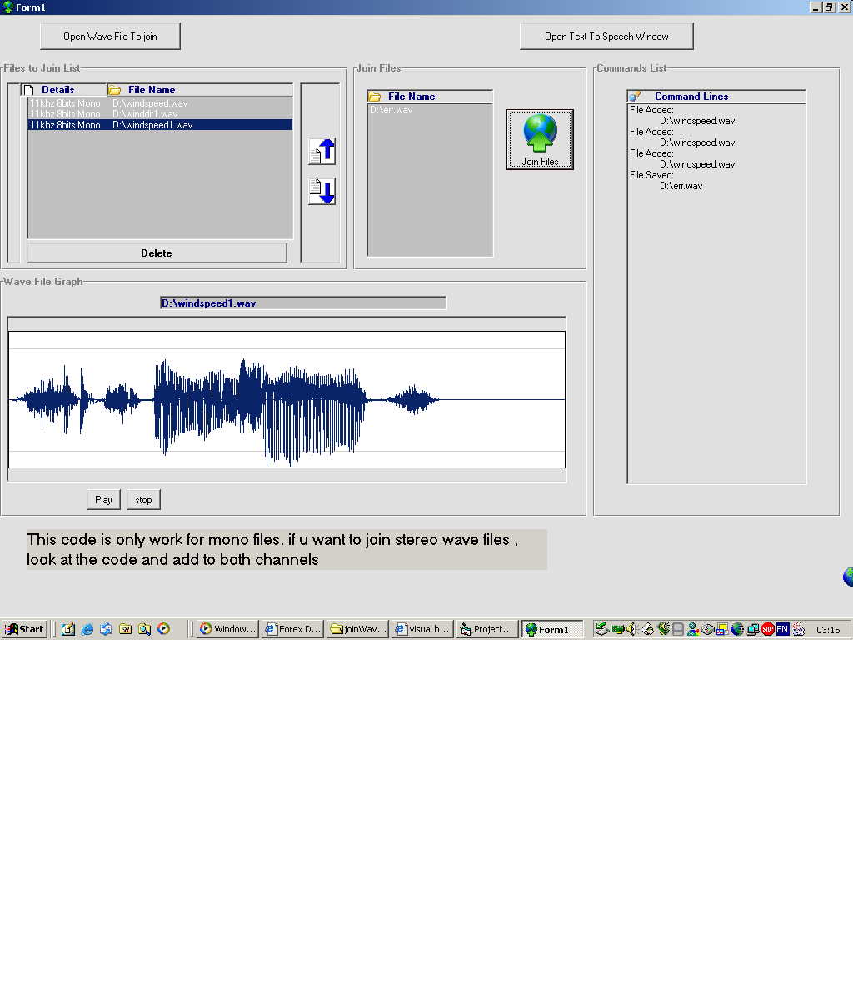



## add /  join  wave files

### Description

join 2 or more wave files in to one wave file, all files must be the same (kHZ, Mono/Streo, Bits). also I use text to speech and text to wave.

I was looking for somting like that I coun't find any code that works, so I took the graph from some other code and fnish it up for the join of the files. the text to speech was taken from microsot example files
 
### More Info
 

             |
---                |---
**Submitted On**   |2004-01-13 02:59:04
**By**             |[hz](https://github.com/Planet-Source-Code/PSCIndex/blob/master/ByAuthor/hz.md)
**Level**          |Advanced
**User Rating**    |5.0 (10 globes from 2 users)
**Compatibility**  |VB 6\.0
**Category**       |[Sound/MP3](https://github.com/Planet-Source-Code/PSCIndex/blob/master/ByCategory/sound-mp3__1-45.md)
**World**          |[Visual Basic](https://github.com/Planet-Source-Code/PSCIndex/blob/master/ByWorld/visual-basic.md)
**Archive File**   |[join\_wave\_1693561122004\.zip](https://github.com/Planet-Source-Code/hz-add-join-wave-files__1-50959/archive/master.zip)

